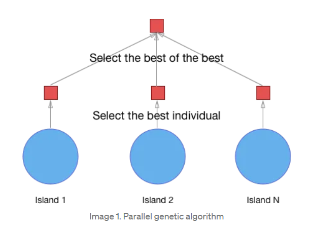
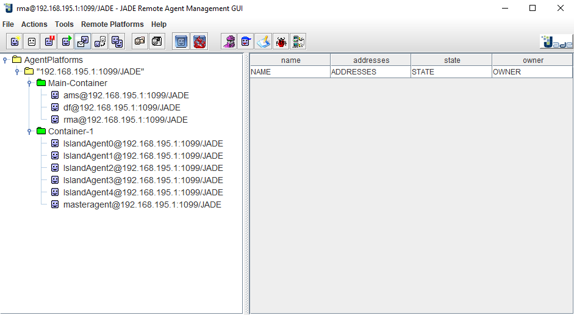

# Genetic Algorithm with SMA for finding the sentence "Bonjour BDCC"

## Table of Contents

- [Introduction](#introduction)
- [Installation](#installation)
- [Usage](#usage)
- [Code](#code)
- [WHO](#who)

## Introduction

<p style="text-align: justify;text-justify: inter-word;">
This project is a simple implementation of a genetic algorithm that finds the sentence <b style="color:blue" >Bonjour BDCC</b> using
an agent-based model. By using <b style="color:green">the Island architecture</b>, each agent represents an island that has its own population.
The agents communicate with each other to exchange the best individuals of their population. The best individual of each population is the one that has the highest fitness value. The fitness value is calculated by comparing the individual's chromosome with the solution's chromosome. The solution's chromosome is the sentence "Bonjour BDCC". The fitness value is the number of characters that are in the right position. For example, the fitness value of the individual "Bonjour BDCC" is 12 because all the characters are in the right position.
</p>

> Island Architecture
> 

## Installation

> Requirements

- Java 8 or higher
- An IDE (IntelliJ IDEA, Eclipse, Netbeans, etc...)
- Jade platform (included in the project)
- Git
- A cup of coffee ☕

> Steps

- Clone the repository

```bash
git clone
```

- Open the project with your favorite IDE
- Add the jade.jar file to the project's dependencies
- Run the project
- Enjoy

## Usage

## Code

> Main container

```Java
public class MainContainer {
    public static void main(String[] args) throws ControllerException {
        Runtime runtime=Runtime.instance();
        ProfileImpl profile=new ProfileImpl();
        profile.setParameter(Profile.GUI,"true"); //démarrer avec GI
        AgentContainer agentContainer=runtime.createMainContainer(profile);
        agentContainer.start();
    }
}
```

> Island Agent

```Java
public class IslandAgent extends Agent {
    private GenticAlgorithm ga=new GenticAlgorithm();

    @Override
    protected void setup() {
        SequentialBehaviour sequentialBehaviour=new SequentialBehaviour();

        sequentialBehaviour.addSubBehaviour(new OneShotBehaviour() {
            @Override
            public void action() {
                ga.initialize();
                ga.sortPopulation();
            }
        });

        sequentialBehaviour.addSubBehaviour(new Behaviour() {
            int iteration=1;
            @Override
            public void action() {
//                System.out.println("Iteration : "+iteration);
                ga.crossover();
                ga.mutation();
                ga.sortPopulation();
                iteration++;
            }
            @Override
            public boolean done() {
                return GAUtils.MAX_ITERATIONS==iteration ||  ga.getBestFintness()==GAUtils.CHROMOSOME_SIZE;
            }
        });

        sequentialBehaviour.addSubBehaviour(new OneShotBehaviour() {
            @Override
            public void action() {
                DFAgentDescription dfAgentDescription = new DFAgentDescription();
                ServiceDescription serviceDescription = new ServiceDescription(); //1ère service
                serviceDescription.setType("ga");
                dfAgentDescription.addServices(serviceDescription);
                DFAgentDescription[] dfAgentDescriptions= null; //myAgent
                try {
                    dfAgentDescriptions = DFService.search(getAgent(), dfAgentDescription);
                } catch (FIPAException e) {
                    throw new RuntimeException(e);
                }

                ACLMessage message=new ACLMessage(ACLMessage.INFORM);
                message.addReceiver(dfAgentDescriptions[0].getName());
                message.setContent(String.valueOf(ga.population[0].getFitness()));
                send(message);
            }
        });

        addBehaviour(sequentialBehaviour);
    }

    @Override
    protected void takeDown() {
        try {
            DFService.deregister(this);
        } catch (FIPAException e) {
            throw new RuntimeException(e);
        }
    }
}
```

> Individual

```Java
package ma.enset.bddc;

public class Individual implements Comparable{
    private char []chromosome=new char[GAUtils.CHROMOSOME_SIZE];
    private int fitness;


    public Individual() {
        Random random = new Random();
        for (int i = 0; i < GAUtils.CHROMOSOME_SIZE; i++) {
            chromosome[i] = GAUtils.ALPHAS.charAt(random.nextInt(GAUtils.ALPHAS.length()));
        }
    }


    public Individual(char[] chromosome) {
        this.chromosome = Arrays.copyOf(chromosome,GAUtils.CHROMOSOME_SIZE);
    }

    public void calculateFintess(){

        for(int i=0;i<GAUtils.CHROMOSOME_SIZE;i++){
            if(GAUtils.solution.charAt(i)==chromosome[i])
                fitness++;
        }
    }

    public int getFitness() {
        return fitness;
    }

    public char[] getChromosome() {
        return chromosome;
    }

    public void setChromosome(char[] chromosome) {
        this.chromosome = chromosome;
    }

    @Override
    public int compareTo(Object o) {
        Individual individual=(Individual) o;
        if (this.fitness>individual.fitness){
            return  1;
        }else if(this.fitness< individual.fitness){
            return -1;
        }else{
            return 0;
        }
    }
}
```

> Master Agent

```Java
public class MasterAgent extends Agent {
    @Override
    protected void setup() {
        DFAgentDescription dfAgentDescription = new DFAgentDescription();
        ServiceDescription serviceDescription = new ServiceDescription(); //1ère service
        serviceDescription.setName("master");
        serviceDescription.setType("ga");
        dfAgentDescription.addServices(serviceDescription);
        try {
            DFService.register(this, dfAgentDescription);
        } catch (FIPAException e) {
            e.printStackTrace();
        }
        addBehaviour(new CyclicBehaviour() {
            @Override
            public void action() {
                ACLMessage receiver=receive();
                if (receiver!=null){
                    System.out.println("Agent : "+receiver.getSender().getName().split("@")[0]+" ** "+receiver.getContent());
                }
            }
        });
    }

    @Override
    protected void takeDown() {
        try {
            DFService.deregister(this);
        } catch (FIPAException e) {
            throw new RuntimeException(e);
        }
    }
}

```

> Simple Container

```Java
public class SimpleContainer {
   public static void main(String[] args) throws ControllerException {
       Runtime runtime=Runtime.instance();
       ProfileImpl profile=new ProfileImpl();
       profile.setParameter(Profile.MAIN_HOST,"localhost");
       AgentContainer agentContainer=runtime.createAgentContainer(profile);

       AgentController master=agentContainer.createNewAgent("master", MasterAgent.class.getName(),new Object[]{});
       master.start();

       for (int i = 1; i < 5; i++) {
           AgentController island=agentContainer.createNewAgent("island"+i, IslandAgent.class.getName(),new Object[]{});
           island.start();
       }
   }
}
```

> GUtils

```Java
public class GAUtils {
    public static final int CHROMOSOME_SIZE = 16;
    public static final int POPULATION_SIZE = 20;
    public static final double MUTATION_PROP = 0.5;
    public static final int MAX_ITERATIONS = 10000;
    public static final String ALPHABETS = "Bonjour BDCC";
    public static final String CHARACTER_SECRET = "abcdefghijklmnopqrstuvwxyzABCDEFGHIJKLMNOPQRSTUVWXYZ0123456789!\"#$%&'()*+,-./:;<=>?@[]^_`{|}~ ";
    public static final int LENGTH_CHARACTER = CHARACTER_SECRET.length();

}
```

> GenticAlgorithm

```Java
public class GenticAlgorithm {
    public Individual[] population=new Individual[GAUtils.POPULATION_SIZE];
    private Individual individual1;
    public Individual individual2;
    public void initialize(){
        for (int i=0;i<GAUtils.POPULATION_SIZE;i++) {
            population[i]=new Individual();
            population[i].calculateFitness();
        }
    }

    public void crossover(){
        individual1=new Individual(population[0].getChromosome());
        individual2=new Individual(population[1].getChromosome());

        Random random=new Random();
        int crossPoint=random.nextInt(GAUtils.CHROMOSOME_SIZE-1);
        crossPoint++;
        for (int i = 0; i <crossPoint ; i++) {
         individual1.getChromosome()[i]=population[1].getChromosome()[i];
         individual2.getChromosome()[i]=population[0].getChromosome()[i];
        }
    }
    public void showPopulation(){
        for (Individual individual:population) {
            System.out.println(Arrays.toString(individual.getChromosome())+" = "+individual.getFitness());
        }
    }
    public void sortPopulation(){
        Arrays.sort(population, Comparator.reverseOrder());
    }
    public void mutation(){
        Random random1=new Random();
        // individual1
        if(random1.nextDouble()>GAUtils.MUTATION_PROP){
            int index = random1.nextInt(GAUtils.CHROMOSOME_SIZE);
            individual1.getChromosome()[index]=character();
        }
        // individual2
        if(random1.nextDouble()>GAUtils.MUTATION_PROP){
            int index = random1.nextInt(GAUtils.CHROMOSOME_SIZE);
            individual2.getChromosome()[index]=character();
        }
        individual1.calculateFitness();
        individual2.calculateFitness();
        population[GAUtils.POPULATION_SIZE-2]=individual1;
        population[GAUtils.POPULATION_SIZE-1]=individual2;
    }
    public int getBestFintness(){
        return population[0].getFitness();
    }

    public String character(){
        return String.valueOf(GAUtils.CHARACTER_SECRET.charAt((int) Math.floor(Math.random() * GAUtils.LENGTH_CHARACTER)));
    }
}
```

> Individual

```Java
public class Individual implements Comparable {
    GenticAlgorithm genticAlgorithm=new GenticAlgorithm();
    private String[] chromosome = new String[GAUtils.CHROMOSOME_SIZE];
    private int fitness;

    public Individual() {
        fitness = 0;
        for (int j = 0; j < GAUtils.CHROMOSOME_SIZE; j++) {
            chromosome[j] = genticAlgorithm.character();
        }
    }

    public Individual(String[] chromosome) {
        this.chromosome = Arrays.copyOf(chromosome, GAUtils.CHROMOSOME_SIZE);
    }

    public int calculateFitness() {
        int cpt = 0;
        for (String gene : chromosome) {
            if (gene.equals(String.valueOf(GAUtils.ALPHABETS.charAt(cpt)))) {
                fitness++;
            }
            cpt++;
        }
        return fitness;
    }

    public int getFitness() {
        return fitness;
    }

    public String[] getChromosome() {
        return chromosome;
    }

    public void setChromosome(String[] chromosome) {
        this.chromosome = chromosome;
    }

    @Override
    public int compareTo(Object o) {
        Individual individual = (Individual) o;
        if (this.fitness > individual.fitness) {
            return 1;
        } else if (this.fitness < individual.fitness) {
            return -1;
        } else {
            return 0;
        }
    }
}
```

## Demo

> Islands
> 

## WHO

This project was created by Abderrahmane Ettounani.
