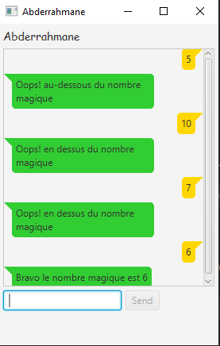
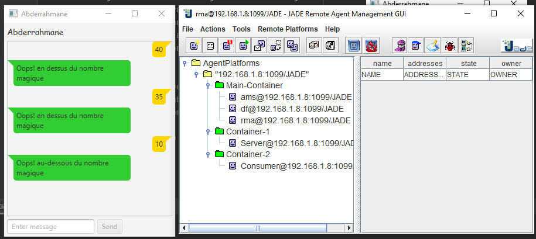

# Guess the Number Multi-Agent System

This is a multi-agent system that implements the "guess the number" game, where the player has to guess a randomly generated number between 1 and 100.
<center></center>

## Technologies Used
- Java 8
- JADE (Java Agent Development Framework) 4.5.0

## Installation
- Clone the repository
- Open the project in your preferred Java IDE (e.g. Eclipse, IntelliJ)
- Run the MainContainer class to start the main container
- Run the ServerContainer class to start the server agent
- Run the AgentClientGui class to start the client agent and the GUI

## How to Play
- Enter your name in the text field and click "Start"
- The client agent will send a message to the server agent to start the game
- The server agent will generate a random number between 1 and 100 
- Guess a number between 1 and 100 by typing it into the text field and clicking "Guess"
- The client agent will send a message to the server agent with your guess
- The server agent will respond with one of three messages:

    ```
      "Bravo le nombre magique est [number]" if you guessed correctly
      "Oops! en dessus du nombre magique" if your guess is too high
      "Oops! au-dessous du nombre magique" if your guess is too low
    ```  
- Continue guessing until you guess correctly or run out of attempts

## Code

> ConsumerAgent 
```Java
public class ConsumerAgent extends GuiAgent {
    private AgentClientGui clientGui;
    @Override
    protected void setup() {
        clientGui=(AgentClientGui) getArguments()[0];
        clientGui.setConsumerAgent(this);
        System.out.println("initialisation"+this.getAID().getName());
        ParallelBehaviour parallelBehaviour=new ParallelBehaviour();
        addBehaviour(parallelBehaviour);
        parallelBehaviour.addSubBehaviour(new CyclicBehaviour() {
            @Override
            public void action() {
                ACLMessage message=receive();
                if(message!=null){
                    System.out.println("Sender: "+message.getSender().getLocalName());
                    System.out.println("Content: "+message.getContent());
                    Platform.runLater(() -> {
                        clientGui.getConversationView().receiveMessage(message.getContent());
                    });
                    System.out.println("SpeechAct: "+ACLMessage.getPerformative(message.getPerformative()));
                }
                else block();
            }
        });
    }

    // ....

    @Override
    public void onGuiEvent(GuiEvent guiEvent) {
        String msg= (String) guiEvent.getParameter(0);
        ACLMessage message=new ACLMessage(ACLMessage.INFORM);
        message.addReceiver(new AID("Server",AID.ISLOCALNAME));
        message.setContent(msg);
        send(message);
    }
}
```
> ServerAgent
```Java
public class ServerAgent extends Agent {
    int number;
    @Override
    protected void setup() {
        number= (int) (Math.random()*100);
        ParallelBehaviour parallelBehaviour=new ParallelBehaviour();
        addBehaviour(parallelBehaviour);
        parallelBehaviour.addSubBehaviour(new CyclicBehaviour() {
            @Override
            public void action() {
                ACLMessage message=receive();
                if (message!=null){
                    ACLMessage reply;
                    int value=checkValue(message.getContent());
                    if(value==0){
                        reply=new ACLMessage(ACLMessage.CONFIRM);
                        reply.setContent("Bravo le nombre magique est "+number);
                        reply.addReceiver(message.getSender());
                        send(reply);
                    }
                    else if(value==1) {
                        reply=new ACLMessage(ACLMessage.DISCONFIRM);
                        reply.setContent("Oops! en dessus du nombre magique");
                        reply.addReceiver(message.getSender());
                        send(reply);
                    }
                    else {
                        reply=new ACLMessage(ACLMessage.DISCONFIRM);
                        reply.setContent("Oops! au-dessous du nombre magique ");
                        reply.addReceiver(message.getSender());
                        send(reply);
                    }
                }
                else block();
            }
        });
    }
    // ..........
  
    public int checkValue(String value){
        int val=Integer.parseInt(value);
        if(val==number)
            return 0;   // 0 good
        else if (val<number) {
            return -1; // -1 au-dessous
        }
        else return 1;


    }

}

```

<center></center>

## WHO
This project was created by [Abderrahmane Ettounani].